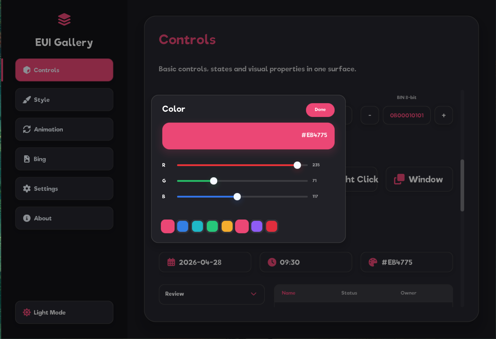

# EUI-NEO

<p align="center">
  
</p>

<p align="center">
  <a href="https://github.com/sudoevolve/EUI-NEO/actions/workflows/release.yml"></a>
  <a href="https://github.com/sudoevolve/EUI-NEO/releases"></a>
  <a href="LICENSE"></a>
  
  
  
  
  <a href="https://github.com/sudoevolve/EUI-NEO/stargazers"></a>
</p>

<p align="center">
  <a href="README.md">English</a>
  ·
  <a href="https://sudoevolve.github.io/EUI-NEO/">官网</a>
</p>

EUI-NEO 是一个基于 C++17 的跨平台高性能轻量级 UI 框架，支持 GLFW/SDL2 窗口后端和 OpenGL/Vulkan 渲染后端。

## 预览

|  |  |
| --- | --- |
|  |  |
|  |  |
|  |  |

## 快速开始

环境要求：

- CMake 3.14+
- 支持 C++17 的编译器
- 默认渲染器需要 OpenGL 开发文件。
- Vulkan SDK 可选。只有需要 Vulkan 渲染器时才使用 `build-vk` 构建目录。
- 平台 OpenGL/windowing 开发文件。Linux 构建还需要 X11 和 libcurl 开发包。

GLFW、glad、tray、FreeType、HarfBuzz、libpng、zlib 等构建期第三方源码已内置在 `3rd/` 下。默认依赖模式是 `auto`：先复用父项目已有的 `glfw` / `glad` target，再尝试包管理器 target，最后才使用本地 `3rd/` 源码或固定上游兜底拉取。需要严格离线构建时，可配置 `-DEUI_DEPS_MODE=bundled`；需要强制联网拉取时，可配置 `-DEUI_DEPS_MODE=fetch`。HarfBuzz shaping 默认启用，可通过 `-DEUI_ENABLE_HARFBUZZ=OFF` 关闭。

内置和 fetch 下载的依赖默认按静态链接构建，包括 GLFW。Release 包因此不需要额外携带 GLFW DLL / dylib / so。只有选择系统 SDL2 包时，SDL2 仍可能是动态库。

默认窗口后端是 GLFW。SDL2 是可选后端，不放进 `3rd/`：如果 GLFW 不可用，或需要测试 SDL2，在构建目录名里加 `sdl2`：

```sh
cmake -S . -B build-sdl2
cmake --build build-sdl2
```

找不到系统 SDL2 包时，加 `-DEUI_DEPS_MODE=fetch` 下载固定版本 SDL2 源码。

macOS / Linux 示例：

```sh
cmake -S . -B build
cmake --build build
./build/gallery
```

显式选择渲染后端示例：

```sh
cmake -S . -B build-vk
cmake --build build-vk --target gallery
```

构建目录后缀会在首次配置时自动识别：`build` 表示 GLFW + OpenGL，`build-sdl2` 表示 SDL2 + OpenGL，`build-vk` 表示 GLFW + Vulkan，`build-sdl2-vk` 表示 SDL2 + Vulkan。已有构建目录存在 CMake cache 时，删除该目录或显式传入 `-DEUI_WINDOW_BACKEND=...` / `-DEUI_RENDER_BACKEND=...`。

Windows / PowerShell 示例：

```powershell
cmake -S . -B build
cmake --build build --config Release
.\build\Release\gallery.exe
```

Linux 依赖提示：

```sh
sudo apt-get install -y ninja-build libx11-dev libxrandr-dev libxinerama-dev libxcursor-dev libxi-dev libgl1-mesa-dev libcurl4-openssl-dev
# -DEUI_WINDOW_BACKEND=sdl2 可选安装：
sudo apt-get install -y libsdl2-dev
```

顶层构建会为 `examples/*.cpp` 下的每个页面源文件生成一个可执行程序，例如 `gallery`、`card_slider` 和 `eui_demo`。构建后会自动把 `assets/` 复制到可执行文件目录。

用户应用可以放在 `apps/` 下，顶层构建默认会像 examples 一样生成可执行文件。支持两种写法：单文件 `apps/my_app.cpp`，或目录式 `apps/my_app/app.cpp`。目录式应用可以带自己的 `apps/my_app/assets/`，构建后会在框架资源复制完成后继续复制到可执行文件旁边的 `assets/` 目录。需要关闭自动扫描时传入 `-DEUI_BUILD_USER_APPS=OFF`。

## 可选模块

可选功能模块位于 `modules/`，详细说明见 [模块指南](docs/模块.md)。

推送 `v*` tag 后，GitHub Actions 会构建 Windows、Linux、macOS 包，并且 release assets 会上传运行包和 SDK 包。运行包会自动收集所有由 `examples/*.cpp` 生成的可执行文件。

## 接入到你的项目

推荐方式是把 EUI-NEO 作为 CMake 子目录加入，使用框架提供的 app main，并通过公共 facade 头文件编写 UI。

最小 CMake：

```cmake
cmake_minimum_required(VERSION 3.14)
project(MyProject LANGUAGES C CXX)

set(CMAKE_CXX_STANDARD 17)
set(CMAKE_CXX_STANDARD_REQUIRED ON)

add_subdirectory(external/EUI-NEO)

add_executable(my_app
    external/EUI-NEO/core/app/glfw_app_main.cpp
    app.cpp
)
eui_neo_configure_app(my_app)
```

最小 `app.cpp`：

```cpp
#include "eui_neo.h"

namespace app {

const DslAppConfig& dslAppConfig() {
    static const DslAppConfig config = DslAppConfig{}
        .title("My App")
        .pageId("my_app")
        .windowSize(960, 640);
    return config;
}

void compose(eui::Ui& ui, const eui::Screen& screen) {
    ui.column("root")
        .size(screen.width, screen.height)
        .padding(32.0f)
        .content([&] {
            ui.text("title")
                .text("Hello EUI-NEO")
                .fontSize(28.0f)
                .build();
        })
        .build();
}

} // namespace app
```

构建：

```sh
cmake -S . -B build -DCMAKE_BUILD_TYPE=Release
cmake --build build --parallel
./build/my_app
```

这种方式下，EUI-NEO 会接管窗口、事件循环、当前选择的渲染后端和资源复制。SDL2、Vulkan、`FetchContent`、自定义 main loop，以及在父项目里构建仓库自带示例的写法，见 [集成指南](docs/集成指南.md)。

## 目录结构

```text
assets/       字体、PNG、SVG 和图标等运行资源
components/   基于 DSL 封装的通用组件
core/         DSL、Runtime、图元、文本、图片、网络和平台能力
docs/         项目实现文档
examples/     独立 gallery 和示例应用源码
modules/      键盘、媒体、串口等可选功能模块
apps/         用户应用源码；支持单文件 .cpp 或目录式 app.cpp
include/      公共 include 路径：eui_neo.h 和 eui/* facade 头文件
tests/        probe 源码、fixture 应用和本地 benchmark 记录
3rd/          内置第三方构建源码和单文件依赖
```

## Docs

- [DSL 设计与当前实现](docs/DSL.md)
- [组件](docs/组件.md)
- [模块](docs/模块.md)
- [状态模型](docs/状态.md)
- [布局](docs/布局.md)
- [事件](docs/事件.md)
- [动画](docs/动画.md)
- [异步](docs/异步.md)
- [渲染后端架构与流程](docs/渲染后端架构.md)
- [Retained Layer Cache](docs/retained_layer_cache.md)
- [图片](docs/图片.md)
- [网络](docs/网络.md)
- [平台能力](docs/平台能力.md)
- [集成指南](docs/集成指南.md)
- [开发与发布](docs/开发与发布.md)

## 许可

EUI-NEO 的原创源码采用 Apache License 2.0。`3rd/` 下的第三方代码、CMake 可选联网拉取的构建期依赖，以及 `assets/` 下随项目分发的字体和图标字体，遵循各自上游许可证和版权声明。

## Star History

<a href="https://www.star-history.com/#sudoevolve/EUI-NEO&Date">
  
</a>
