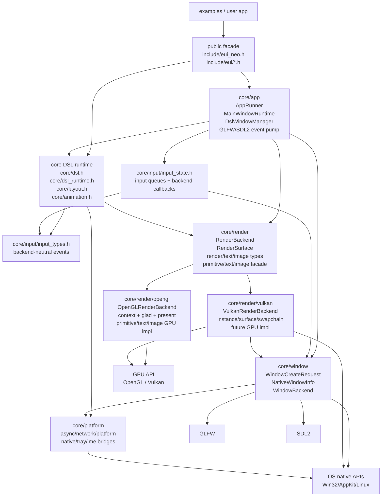

# 渲染后端架构

本文定义 Vulkan 接入前后的目标架构。后续实现必须按本文收束，不能继续把 GLFW、SDL2、OpenGL、Vulkan、平台 native 能力和 runtime 状态用临时胶水混在一起。

## 目标

EUI-NEO 的窗口系统、应用主循环、DSL runtime 和渲染后端必须形成稳定边界：

- `WindowBackend` 负责窗口和输入，不负责绘制。
- `RenderBackend` 负责 GPU 后端和帧生命周期，不负责窗口事件。
- `AppRunner` 负责主循环状态机，不知道 OpenGL/Vulkan 细节。
- `core::dsl::Runtime` 负责 DSL 树、layout、事件、dirty rect 和 render dispatch，不持有具体窗口库类型。
- primitive/text/image 的公共头只暴露 DSL/runtime 需要的 API 和后端无关类型，不暴露 `GL*`、Vulkan handle 或窗口库类型。

## 分层

```text
examples / user app
  |
include/eui_neo.h, include/eui/*
  |
app facade / AppRunner / WindowManager
  |
WindowBackend ------------------ RenderBackend
  |                                  |
GLFW / SDL2                         OpenGL / Vulkan
  |                                  |
native window handles               GPU resources, frame lifecycle
```

## 完成结构图

完成后的架构必须按下面的方向依赖。上层可以调用下层，平级模块之间只能通过明确接口交互，不能互相偷实现细节。



边界规则：

- `core/app` 只调 `WindowBackend`、`InputState`、`RenderBackend`，不碰 `gl*` / `vk*`。
- `core/window` 只产出窗口、输入所需基础能力和 `NativeWindowInfo`，不创建 shader/texture/swapchain。
- `core/render` 公共层只放后端无关接口和类型；OpenGL/Vulkan 代码必须落到各自子目录。
- Vulkan 后端必须实现与 OpenGL 后端一致的 DSL 视觉语义；禁止用 bounding box、纯色近似、功能占位或“先能看到东西”的临时绘制替代真实 primitive/text/image 实现。
- `core/input/input_types.h` 可以被 public facade 和组件使用；`input_state.h` 只给 runtime/app 后端输入流程使用。
- `core/platform` 只放系统能力和 native bridge，不再放窗口后端、输入事件类型或渲染后端。

### Public Facade

对外只稳定暴露：

- `include/eui_neo.h`
- `include/eui/*.h`

Public facade 不得包含：

- `GLFWwindow*`
- `SDL_Window*`
- `<glad/glad.h>`
- Vulkan 头
- OpenGL/Vulkan 专属实现头

### WindowBackend

职责：

- 创建、销毁、显示、隐藏窗口。
- 查询 framebuffer size、window size、DPI、pointer scale。
- 收集窗口事件、鼠标、键盘、滚轮、文本输入。
- 输入法候选框定位。
- 剪贴板、光标、窗口图标。
- native handle 暴露给平台能力或渲染 surface 创建。
- 父子窗口、modal、focus、raise。

非职责：

- 不创建 shader、texture、framebuffer、swapchain。
- 不绘制 primitive/text/image。
- 不持有 render cache。
- 不在事件泵里写 OpenGL/Vulkan draw/present 分支。

### RenderBackend

职责：

- 根据窗口后端提供的 surface/native 信息初始化渲染目标。
- 管理 OpenGL context 或 Vulkan surface/swapchain/device/frame resources。
- `beginFrame`、`resize`、`clear`、`render cache`、`present`、`release`。
- 管理后端专属 primitive/text/image GPU resource。
- 处理 minimized/zero-size 窗口。

非职责：

- 不读取 GLFW/SDL2 事件。
- 不决定窗口是否关闭、隐藏托盘、modal focus。
- 不修改 DSL 树和 layout。

### Render Backend Selection

渲染后端选择由 CMake 的 `EUI_RENDER_BACKEND` 控制：

- `auto`：默认。Vulkan SDK 存在、实验 Vulkan backend 显式启用且 EUI Vulkan backend 可用时解析为 Vulkan，否则解析为 OpenGL。
- `opengl`：强制 OpenGL。
- `vulkan`：强制 Vulkan；Vulkan SDK 不存在、实验 Vulkan backend 未启用或 EUI Vulkan backend 不可用时配置失败，不静默回退。

默认策略必须保持：

```text
Vulkan 可用 -> 使用 Vulkan
Vulkan 不可用 -> 回退 OpenGL
```

这里的“可用”同时要求系统 Vulkan SDK/loader 可用、`EUI_ENABLE_EXPERIMENTAL_VULKAN_BACKEND=ON`，以及 EUI 自身 Vulkan backend 已实现并可初始化。只检测到 SDK 不等于后端可用。

### AppRunner

职责：

- 帧时间、FPS 标题、主动节流、按需渲染。
- 主窗口和子窗口共用 update/render 状态机。
- 按顺序调用 window event、runtime update、render backend frame。

非职责：

- 不知道 OpenGL/Vulkan。
- 不直接调用 `gl*`、`vk*`。
- 不直接依赖 `GLFWwindow*` / `SDL_Window*`，只通过 window handle 或窗口后端回调。

### Runtime

职责：

- DSL 树 compose/layout。
- 交互、焦点、IME rect、dirty rect、动画状态。
- 调用后端无关 primitive/text/image facade。

非职责：

- 不创建 OpenGL/Vulkan resource。
- 不包含窗口库类型。
- 不包含 Vulkan/OpenGL 分支。

## 核心接口草案

接口命名可在实现时微调，但职责边界不能变。

### WindowCreateRequest

窗口后端创建窗口前只接收后端无关需求。

```cpp
namespace core::window {

enum class RenderApi {
    OpenGL,
    Vulkan
};

struct WindowCreateRequest {
    int width = 0;
    int height = 0;
    const char* title = "";
    bool resizable = true;
    bool highDpi = true;
    bool modal = false;
    Handle parent = nullptr;
    RenderApi renderApi = RenderApi::OpenGL;
};

struct NativeWindowInfo {
    Handle handle = nullptr;
    void* platformWindow = nullptr;
    void* display = nullptr;
};

} // namespace core::window
```

规则：

- GLFW OpenGL 内部设置 OpenGL context hints。
- GLFW Vulkan 内部设置 `GLFW_CLIENT_API = GLFW_NO_API`。
- SDL2 OpenGL 内部设置 `SDL_WINDOW_OPENGL` 和 GL attributes。
- SDL2 Vulkan 内部设置 `SDL_WINDOW_VULKAN`。
- 上层不得直接散落这些 hint/flag。

### RenderSurface

`RenderSurface` 是窗口和渲染后端之间的唯一握手层。

```cpp
namespace core::render {

struct RenderSurface {
    core::window::Handle window = nullptr;
    core::window::NativeWindowInfo native;
    int framebufferWidth = 0;
    int framebufferHeight = 0;
    float dpiScale = 1.0f;
};

} // namespace core::render
```

规则：

- OpenGL 后端可从 `RenderSurface` 绑定/管理 context。
- Vulkan 后端可从 `RenderSurface` 创建 surface/swapchain。
- `WindowBackend` 只提供信息，不参与 draw/present。

### RenderBackend

目标接口：

```cpp
namespace core::render {

class RenderBackend {
public:
    virtual ~RenderBackend() = default;

    virtual bool initialize(const RenderSurface& surface) = 0;
    virtual void shutdown() = 0;
    virtual void resize(const RenderSurface& surface) = 0;

    virtual void beginFrame(const RenderSurface& surface) = 0;
    virtual void endFrame() = 0;
    virtual void present() = 0;

    virtual bool ensureRenderCache(int width, int height) = 0;
    virtual bool renderCacheWasRecreated() const = 0;
    virtual void releaseRenderCache() = 0;
    virtual void beginRenderCacheFrame(int width, int height) = 0;
    virtual void endRenderCacheFrame() = 0;
    virtual void blitRenderCache(int width, int height) = 0;
    virtual void clear(const core::Color& color) = 0;
    virtual void setScissor(bool enabled, const core::Rect& rect, int framebufferHeight) = 0;
};

} // namespace core::render
```

短期允许现有 `makeCurrent()` / callback 构造继续存在，但它是迁移中间态，不是最终接口。

## 文件归属

目标目录：

```text
core/window/
  window_types.h
  window_backend.h
  window_metrics.h
  glfw/
    glfw_window_backend.cpp
  sdl2/
    sdl2_window_backend.cpp

core/input/
  input_types.h
  input_state.h

core/render/
  render_backend.h/.cpp
  render_surface.h
  render_types.h
  primitive_geometry.h
  primitive.cpp
  text_types.h
  image_types.h
  primitive.h
  text.h
  image.h

core/render/opengl/
  opengl_backend.h/.cpp
  opengl_context_glfw.cpp
  opengl_context_sdl2.cpp
  opengl_primitives.cpp
  opengl_text.cpp
  opengl_image.cpp
  opengl_cache.cpp

core/render/vulkan/
  vulkan_backend.h/.cpp
  vulkan_surface_glfw.cpp
  vulkan_surface_sdl2.cpp
  vulkan_swapchain.cpp
  vulkan_text.cpp
  vulkan_image.cpp
  vulkan_cache.cpp

core/app/
  app_runner.h
  main_window_runtime.h
  dsl_window_manager.h
  dsl_window_runtime.h
  app_main.cpp

core/platform/
  async.h/.cpp
  network.h/.cpp
  platform.h/.cpp
  native_bridge.*
  tray_bridge.*
  ime_bridge.*
```

约束：

- `core/render/opengl/*` 可以 include `<glad/glad.h>`。
- `core/render/vulkan/*` 可以 include Vulkan 头。
- `core/app/*` 不应直接 include `<glad/glad.h>` 或 Vulkan 头。
- `include/eui/*`、`components/*`、`examples/*` 不应 include OpenGL/Vulkan 专属头。
- `core/platform/*` 只放系统能力和 native bridge，不再放窗口后端、输入事件类型或渲染后端。

## 迁移顺序

### 阶段 1：冻结边界文档

只做文档和待办收束，不改实现。

完成标准：

- 本文存在并被路线图引用。
- 路线图明确下一步只允许按本文阶段推进。

### 阶段 2：定义 RenderSurface 和窗口创建请求

新增后端无关类型，不迁移所有逻辑。

完成标准：

- `RenderSurface` / `WindowCreateRequest` 类型存在。当前落地位置为 `core/render/render_surface.h` 和 `core/window/window_types.h`。
- GLFW/SDL2 app main 仍可保持现状，但新类型能表达 OpenGL/Vulkan 所需信息。
- 不新增胶水 helper 包装 `gl*`，除非它落在最终接口里。

### 阶段 3：收束窗口创建

把 GLFW/SDL2 的窗口创建、GL context hints、Vulkan window flags 收到窗口后端实现。

完成标准：

- app main 不直接写 `glfwWindowHint(GLFW_CONTEXT_*)`。
- app main 不直接写创建主窗口所需的 `SDL_GL_SetAttribute(...)`。
- app main 根据 CMake 选择的 render api 请求窗口。

当前拆分：

- 窗口创建、GLFW hints、SDL window flags 已进入 `core::window::createWindow(WindowCreateRequest)`。
- SDL OpenGL context sharing 已进入 `OpenGLRenderBackend`，app main 不再保存 `SDL_GLContext`。

### 阶段 4：收束渲染 surface/context

把 OpenGL context 创建/加载和 Vulkan surface 创建放入渲染后端边界。

完成标准：

- app main 不直接 include `<glad/glad.h>`。
- app main 不直接调用 `gladLoadGLLoader`。
- app main 不直接调用 `SDL_GL_CreateContext` / `glfwMakeContextCurrent`，除非仍处于明确标记的迁移点。
- Vulkan 后端能初始化 instance/surface/swapchain 并 clear/present。

当前拆分：

- `OpenGLRenderBackend` 拥有 OpenGL context lifecycle、glad loading、make current、present 和 render cache。
- `VulkanRenderBackend` 实验实现已拥有 instance、surface、device、swapchain、render pass、framebuffer、command buffer、clear、present 和 cleanup。
- GLFW/SDL2 app main 只通过 `core::render::createRenderBackend(...)` 创建后端对象并调用 `initialize()`；不再直接依赖 OpenGL/Vulkan 具体后端类。
- GLFW/SDL2 app main 通过 `core::render::windowRenderApi()` 填充 `WindowCreateRequest::renderApi`，不再硬编码 OpenGL 窗口请求。
- GLFW/SDL2 app main 不再直接加载 OpenGL 函数或保存 SDL GL context。
- `RenderBackend::beginFrame` 已改为接收 `RenderSurface`，窗口、framebuffer 尺寸和 DPI 进入同一个 frame surface 参数。
- `core::window::nativeWindowInfo(window)` 已提供窗口后端 native info；SDL2 main 不再自己读取 `SDL_SysWMinfo`。
- 主窗口和子窗口的 `RenderSurface::native` 已由窗口后端填充；后续 Vulkan surface/swapchain 初始化可以直接从 `RenderSurface` 读取窗口句柄。
- Vulkan primitive、text 和 image 已开始接入真实绘制；稳定 UI 绘制必须继续按阶段 5 收束 CPU/GPU 资源边界并做 OpenGL/Vulkan 视觉验收。

### 阶段 5：拆 CPU 资源和 GPU 资源

继续拆 text/image。

完成标准：

- 图片解码、GIF 帧、远程缓存可以被 OpenGL/Vulkan 共用；当前 Vulkan image 已先接入真实 texture/draw，后续需要把 OpenGL/Vulkan 重复的图片 CPU 逻辑继续收束。
- `stb_image` 实现已拆到共享 `core/render/stb_image_impl.cpp`，不再由 OpenGL image 后端隐式提供给窗口图标或其他公共逻辑。
- primitive 状态实现已收束到共享 `core/render/primitive.cpp`。
- primitive transform、shadow 扩张、圆角矩形顶点和 polygon triangle fan 已抽到共享 `core/render/primitive_geometry.h`，OpenGL/Vulkan primitive 不再各自复制这部分 CPU 几何语义。
- primitive 绘制已通过 `RenderBackend::drawRoundedRect(...)` 下发后端无关 draw command；OpenGL/Vulkan 只负责执行 GPU 绘制。
- text font resolving、shaping、metrics 已收束到共享 `core/render/text.cpp`，OpenGL/Vulkan 使用同一份 glyph vertices 和 atlas CPU 数据。
- OpenGL atlas/texture/draw 留在 `core/render/opengl/*`。
- Vulkan atlas/texture/draw 留在 `core/render/vulkan/*`。

### 阶段 6：Vulkan 最小后端

只做 clear color、resize、present、resource cleanup。

完成标准：

- `EUI_RENDER_BACKEND=vulkan` 可以 configure。
- `EUI_RENDER_BACKEND=auto` 在 Vulkan 可用且 `EUI_ENABLE_EXPERIMENTAL_VULKAN_BACKEND=ON` 时解析为 Vulkan，不可用时解析为 OpenGL。
- GLFW Vulkan gallery 显示 clear。
- SDL2 Vulkan gallery 显示 clear。
- 历史阶段要求：不接 primitive/text/image，直到 frame lifecycle 稳定。当前 frame lifecycle 已进入实验后续阶段。

### 阶段 7：Vulkan 视觉等价 primitive

从 `RoundedRectPrimitive` 和 `PolygonPrimitive` 开始，逐项对齐 OpenGL 后端视觉语义。

完成标准：

- `RoundedRectPrimitive` 支持 fill、gradient、corner radius、border、shadow、opacity、transform、clip/scissor。
- `PolygonPrimitive` 支持实际 polygon 轮廓、opacity、transform、clip/scissor。
- 不能提交 bounding box 替代实现。
- `primitive_parity` 示例在 Vulkan/OpenGL 下截图对比无明显视觉差异后，才进入 text/image。当前 text/image 已开始实验接入，仍需继续做视觉对比验收。

当前状态：

- 已接入预编译 SPIR-V primitive pipeline，不依赖构建期 shader compiler；shader 源文件保留在 `core/render/vulkan/shaders/`，修改后再重新生成 SPIR-V 头文件。
- OpenGL/Vulkan 已共用 `primitive_geometry.h` 里的 transform、shadow geometry 和基础三角化逻辑，减少后端视觉漂移来源。
- `RoundedRectPrimitive` / `PolygonPrimitive` 状态和 render dispatch 已收束到共享 `core/render/primitive.cpp`，不再由 OpenGL/Vulkan 各自实现一份类状态。
- `RenderBackend::drawRoundedRect(...)` 已成为 primitive 后端绘制边界；旧的 Vulkan 专属 `vulkan_primitives.cpp` 已删除。
- 已新增 `examples/primitive_parity.cpp` 作为 primitive-only 视觉验收入口，避免 gallery 的 text/image/no-op 状态干扰 primitive 对比；该 fixture 包含 controlled blur 样本。
- `RoundedRectPrimitive` 已支持 SDF fill、gradient、corner radius、border、shadow、opacity、transform、clip/scissor。
- `PolygonPrimitive` 已支持实际 polygon 三角化 fill、opacity、transform、clip/scissor。
- Vulkan backdrop blur 已接入真实 swapchain snapshot + sampler 路径；还需要人工/截图对比验收后，才能标记为 primitive 视觉等价完成。

### 阶段 8：Vulkan 视觉等价 text/image

从 `TextPrimitive` / `ImagePrimitive` 继续对齐 OpenGL 后端视觉语义。

完成标准：

- 文本和图标使用共享字体解析、fallback、HarfBuzz shaping、metrics、gray/color atlas CPU 数据。
- Vulkan text 每个 draw 使用帧内独立 vertex buffer offset，不能覆盖同帧之前录制的文本 draw。
- 图片支持静态图、GIF、remote/Bing、SVG 栅格化、fit、tint、opacity、corner radius、transform、clip/scissor。
- Vulkan image 每个 draw 使用帧内独立 vertex buffer offset，不能覆盖同帧之前录制的图片 draw。
- OpenGL/Vulkan gallery 手测无明显文本、图标和图片缺失后，再进入 render cache。

当前状态：

- `TextPrimitive` CPU 层已收束到共享 `core/render/text.cpp`。
- OpenGL text 和 Vulkan text 分别只负责 atlas texture 上传、descriptor/pipeline 和 draw。
- Vulkan image 已接入真实 texture pipeline，支持静态图、GIF、remote/Bing 和 SVG 栅格化。
- 还需要继续把 OpenGL/Vulkan 重复的图片解码、GIF 和远程缓存逻辑收束到共享 CPU 层。

## 禁止事项

- 禁止新增 `main_vulkan.cpp`、`main_sdl2_vulkan.cpp` 这类并行 main。
- 禁止把 Vulkan 分支塞进 GLFW/SDL2 事件泵。
- 禁止为了“先跑起来”新增长期兼容壳。
- 禁止用 bounding box、纯色块、no-op 或其他近似绘制冒充 Vulkan primitive/text/image 后端完成。
- 禁止 public include 透出 OpenGL/Vulkan 专属类型。
- 禁止只把 `gl*` 调用包一层 helper 就宣称完成架构收束。
- 禁止保留旧文件路径、旧 include、旧文档引用不清理。

## 每阶段验证

每次架构改动至少执行：

```bash
git diff --check
cmake --build --preset glfw-release --target gallery --parallel
cmake --build --preset sdl2-release --target gallery --parallel
cmake --build --preset glfw-release --target primitive_parity --parallel
cmake --build --preset sdl2-release --target primitive_parity --parallel
cmake --build --preset vulkan-glfw-release --target primitive_parity --parallel
cmake --build --preset vulkan-sdl2-release --target primitive_parity --parallel
```

涉及 public/include 或 examples 时额外执行：

```bash
rg -n "glad|OpenGL|Vulkan|GLFWwindow\\*|SDL_Window\\*" include components examples -g'*.h' -g'*.cpp'
```

涉及发布前稳定性时执行：

```bash
cmake --build --preset glfw-release --target gallery demo clock calculator serial_tool --parallel
cmake --build --preset sdl2-release --target gallery serial_tool --parallel
```
